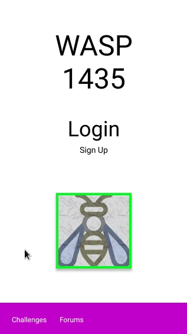
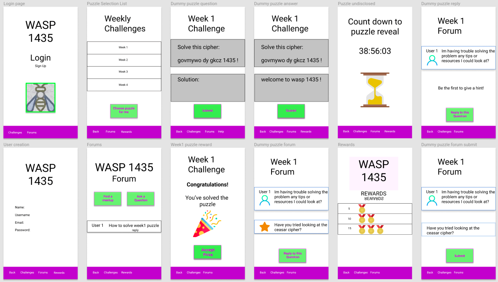

# Wasp 1435

### App Description

Allows users to participate in weekly or monthly curated security puzzles. Puzzle solvers will get to meet other users at the end of the puzzle. Puzzle winners will receive virtual rewards or a tangible reward depending on the difficulty. To receive a tangible reward, puzzle solvers are encouraged to meet in the real world. Puzzles are timed, and each stage may have a price to encourage further progress.
To solve these puzzle, users will require to know some amount of encryption/decryption, security vulnerabilities and best practices. Overall, this app is similar to a security themed CTF (capture the flag).

### General App Attributes

- Mobile: Once you start the game, it asks you, if it can access your location. So, if you are stuck on a puzzle you can see the level on which people are. These people need to be within 15 miles radius. You can then ask them for help. So, bascially, you can just play the game alone or with other people.
- Story: Inspired by Cicada 3301. Cicada was  an internet puzzle that was first started on January 4th and ran for three years to collect very intelligent individuals. So this app is to unite or get intelligent puzzle breakers together.
- Market: Under 18 get a virtual gift. Over 18, you have the option of coosing between a virtual gift or tangible gift. Over 18, after two virtual gifts, you have to choose a tangible gift. We will have several meetups, you can go there or get a monetary reward (gift cards).
- Habit: Puzzles can span a week or a month depending on difficulty and the number of stages to pass. Roughly about weekly usage. Users will be able to participate in the puzzles itself, and may be able contribute in giving puzzle suggestions.
- Scope: puzzle creation would take a good amount of time. Will require ads or sponsorship as a source of revenue and to curate puzzles. A way to manage or deploy weekly and monthly puzzle, will need to be considered. A stripped-down version of this app is still interesting to build. 

## WASP 1435 Product Spec

### 1. User Stories (Required and Optional)

**Required Must-have Stories**

 * Create user account
 * Login for users
 * puzzles/ challenges 
 * reward/ points system
 * chat/ meetup

**Optional Nice-to-have Stories**

 * Monetary rewards for harder puzzles
 * Users could puzzle suggestions

### 2. Screen Archetypes

 * Login/Welcome (user stats/profile)
    * Create user account
    * Login for users
     
 * Puzzle selection list (scrolldown)
    * daily login rewards
    * puzzles/ challenges 
   
 * Solved puzzle rewards 
    * reward/ points system
 
 * User forums
     * chat/ meetup

### 3. Navigation

**Tab Navigation** (Tab to Screen)

 * Home
 * Puzzle Selection
 * User Profile
 * Rewards

**Flow Navigation** (Screen to Screen)

 * Login
   * Enter user credentials 
   * Create new user account
     * Profile setup

 * Puzzle selection
     * Details on problem
         * Solved puzzle rewards
             * User selects a reward from three options
     * Hints
         * User loses points from using hints
         
 * User profile
     * To view user statistics and details

 * Rewards 
     * list of rewards collected and list of rewards to collected

### 📱 Wireframe

[View the Current Wasp 1435 Wireframe on Figma](https://www.figma.com/file/UWs4KAQvY8XT1IWMeJsZccc1/Wasp-1435-Wireframe?node-id=0%3A1) 

Others:

- [Link to Wireframe Version 1](https://i.imgur.com/ddw0s5h.png)
- [Link to gif Demo Version 1](https://i.imgur.com/gywaKMm.gif)

### 📺 App Pitch Presentation

Google Slide links:

- [Slide Deck Latest 💯 Version](https://docs.google.com/presentation/d/1bm6nu_xd5UTX4aBJwjItyu_cjxzdkC4M-uq7aS2iQr8/edit?usp=sharing)

- [Slide Deck Version 1️⃣](https://docs.google.com/presentation/d/1bm6nu_xd5UTX4aBJwjItyu_cjxzdkC4M-uq7aS2iQr8/edit?usp=sharing)

