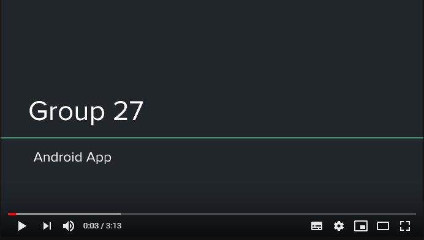

# Wasp 1435

### App Description

Allows users to participate in periodical releases of puzzles. Solving an entire puzzles offers the player virtual in-game rewards, as well as real-life prizes depending on the difficulty. Also offers a forum, to create a sense of community. 

Future plans include: 

1. Solving puzzles to to reveal meetup locations to connect with other users 
2. Sponsorship from companies
3. Opensourcing puzzle creation

To solve these puzzle, users will require to know some amount of encryption/decryption, security vulnerabilities and best practices. Overall, this app is similar to a security themed CTF (capture the flag) and printed or electronic badge puzzle solving at hacking/security conferences. 

### General App Attributes

- Mobile: Offers a text based forum, to allow users to ask for advice on particular puzzle problem. 

- Story: The App name is inspired by `Cicada 3301`. Cicada was an internet puzzle that was first started on January 4th and ran for three years to collect very intelligent individuals. `Wasp 1435` aims to brings smart and creative people together with puzzle solving and encourage others to participate, by simulating problem-solving activities found at security/hacking conferences. 

- Market: People who like sudoku/chess, like to be challenged, tired of candy crush, and wants a brain teaser. Considering that there will be a future option to meet other users of the app, users must be 18 and above in order to activate this functionality. 

- Habit: Solving a puzzle can span a week or a month depending on difficulty and the number of stages to pass. Roughly about weekly usage. Future option would be to have users provide ideas/suggestions and/or allow users create their entire puzzle (similar to a quest) for other users solve by submitting a proposal to the app.

- Scope: puzzle creation would take a good amount of time. Will require ads for source of income to continuously curate and develop puzzles and/or sponsorships as a source of events. A way to manage or deploy weekly and monthly puzzles, will need to be considered. A stripped-down version of this app is still interesting to build. 

NOTE: the word `puzzle(s)` can be interchangeably used with the word `quest`. 

## WASP 1435 Product Spec

### 1. User Stories (Required and Optional)

**Required Must-have Stories**

 * Create user account
 * Login for users
 * puzzles/ challenges 
 * reward/ points system
 * chat/ meetup

**Optional Nice-to-have Stories**

 * Monetary rewards for harder puzzles
 * Users could puzzle suggestions

### 2. Screen Archetypes

 * Login/Welcome (user stats/profile)
    * Create user account
    * Login for users
     
 * Puzzle selection list (scrolldown)
    * daily login rewards
    * puzzles/ challenges 
   
 * Solved puzzle rewards 
    * reward/ points system
 
 * User forums
     * chat/ meetup

### 3. Navigation

**Tab Navigation** (Tab to Screen)

 * Home
 * Puzzle Selection
 * User Profile
 * Rewards

**Flow Navigation** (Screen to Screen)

 * Login
   * Enter user credentials 
   * Create new user account
     * Profile setup

 * Puzzle selection
     * Details on problem
         * Solved puzzle rewards
             * User selects a reward from three options
     * Hints
         * User loses points from using hints
         
 * User profile
     * To view user statistics and details

 * Rewards 
     * list of rewards collected and list of rewards to collected

### 📱 Wireframe

[View the Current Wasp 1435 Wireframe on Figma](https://www.figma.com/file/UWs4KAQvY8XT1IWMeJsZccc1/Wasp-1435-Wireframe?node-id=0%3A1) 

Others:

- [Link to Wireframe Version 1](https://i.imgur.com/ddw0s5h.png)
- [Link to gif Demo Version 1](https://i.imgur.com/gywaKMm.gif)

### 📺 App Pitch Presentation

Google Slide links:

- [Slide Deck Latest 💯 Version](https://docs.google.com/presentation/d/1RtOc8Mq8tp9WwGpUfHEdMaC6Zo0Czh5O-TCvdW6ZRZ4/edit?usp=sharing)

- [Slide Deck Version 1️⃣](https://docs.google.com/presentation/d/1bm6nu_xd5UTX4aBJwjItyu_cjxzdkC4M-uq7aS2iQr8/edit?usp=sharing)

